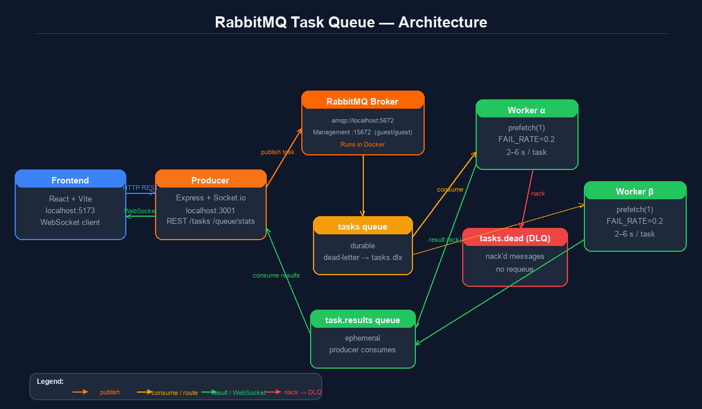

# RabbitMQ Task Queue Demo

A local demo of a distributed task queue built with RabbitMQ, Node.js, and React. Tasks are published via an Express/Socket.io producer, consumed by one or more workers, and results stream back to a live dashboard in real time. Failed tasks are routed to a dead-letter queue.

## Architecture



```
Frontend (Vite/React)  →  Producer (Express + Socket.io)  →  RabbitMQ
                                        ↑                        ↓
                                   results queue            tasks queue
                                                                 ↓
                                                          Worker(s) (Node.js)
```

- **Producer** (`producer/`) — HTTP API on `:3001`, enqueues tasks, consumes the results queue, pushes updates to the frontend via WebSocket.
- **Worker** (`worker/`) — pulls tasks one at a time (`prefetch(1)`), simulates work (2–6 s), acks on success or nacks to the dead-letter queue on failure.
- **Frontend** (`frontend/`) — Vite/React dashboard, talks to the producer over HTTP and WebSocket.

## Prerequisites

- [Node.js](https://nodejs.org) v18+
- [Docker](https://www.docker.com) (for RabbitMQ)

## Local setup

### 1. Start RabbitMQ

```bash
docker compose up -d
```

RabbitMQ will be available at:
- AMQP: `amqp://localhost:5672`
- Management UI: http://localhost:15672 (guest / guest)

### 2. Install dependencies

Run this once in each package directory:

```bash
cd producer && npm install
cd ../worker  && npm install
cd ../frontend && npm install
```

### 3. Start the producer

```bash
cd producer
npm run dev
```

The API listens on http://localhost:3001.

### 4. Start one or more workers

Open a new terminal for each worker:

```bash
# terminal A
cd worker
WORKER_ID=alpha node src/worker.js

# terminal B
cd worker
WORKER_ID=beta node src/worker.js
```

`WORKER_ID` is optional — a random ID is generated if omitted.  
`FAIL_RATE` (default `0.2`) controls the simulated failure probability, e.g. `FAIL_RATE=0.5`.

### 5. Start the frontend

```bash
cd frontend
npm run dev
```

Open http://localhost:5173 in your browser.

## Environment variables

| Variable | Default | Description |
|---|---|---|
| `RABBITMQ_URL` | `amqp://localhost` | RabbitMQ connection URL (producer & worker) |
| `PORT` | `3001` | Producer HTTP port |
| `WORKER_ID` | random | Display name for the worker |
| `FAIL_RATE` | `0.2` | Fraction of tasks that deliberately fail (0–1) |

## Stopping

```bash
docker compose down
```
